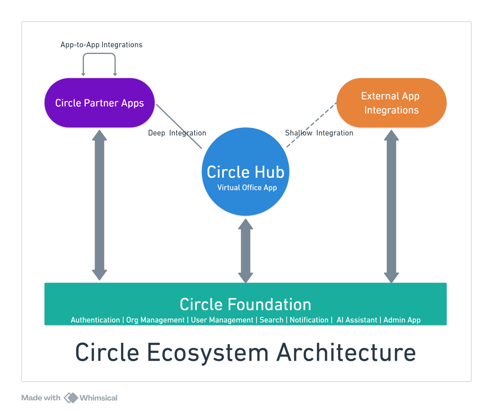

# Circle Ecosystem Architecture Requirements

Created by: Krishnamurthy Hegde

# 

## 1. Document Information

**Document Title:** Circle Ecosystem Architecture Requirements

**Version:** 1.0

**Date:** May 3, 2025

**Status:** Draft

## 2. Introduction

### 2.1 Purpose

This document outlines the architectural requirements for the Circle Ecosystem, a platform designed to facilitate virtual office experiences through a core application and integrated partner applications. It provides guidelines for development, integration, and deployment of all ecosystem components.

### 2.2 Intended Audience

- Circle Platform Development Team
- Circle Platform Partners (third-party developers)
- Technical Stakeholders
- Product Management

## 3. Scope

This document covers the high-level architecture requirements for the Circle Ecosystem, including:

- Core component definitions and responsibilities
- Integration standards and protocols
- Technical constraints and requirements
- Multi-platform support
- Authentication and security requirements

## 4. Terminology

| Term | Definition |
| --- | --- |
| **Circle Ecosystem** | The entire platform ecosystem including the Hub, Circle Partner Apps, External App Integrations, and Foundation services |
| **Circle Hub** | Core application enabling users to create virtual offices, view presence information, and communicate |
| **Circle Partner Apps** | Independent third-party applications with deep integration capabilities within the Circle Ecosystem |
| **External App Integrations** | Connections to established external platforms via their exposed APIs |
| **Circle Foundation** | Common set of services supporting the entire ecosystem |
| **Circle** | A digital space (a virtual office) created within the Circle Hub for collaboration |

## 5. System Overview

### 5.1 Ecosystem Components

### 5.1.1 Circle Hub

The central application within the Circle Ecosystem that provides:

- Creation and management of virtual offices ("circles")
- Real-time presence information for users within virtual offices
- Communication interfaces with Circle Partner Apps and External App Integrations
- Discovery and access to Circle Partner Apps

### 5.1.2 Circle Partner Apps

Independent applications developed by third-party vendors that:

- Integrate deeply with Circle Hub and other Circle Partner Apps
- Utilize Circle Foundation services
- May offer competing solutions for the same functionality
- Are customer-selectable based on specific needs
- Extend the core Hub functionality in specialized ways

### 5.1.3 External App Integrations

Connections to established platforms such as:

- Video conferencing platforms (Zoom, Google Meet)
- Communication tools (Slack, Microsoft Teams)
- Productivity suites (Google Workspace, Microsoft 365)
- Calendar applications (Google Calendar, Outlook)
- Project management tools (Asana, Trello, Jira)

### 5.1.4 Circle Foundation

Core infrastructure services including:

- Authentication and identity management
- Organization and user onboarding
- User profile management
- Global search functionality
- Cross-application notification system
- Conversational AI agent
- API gateway and management
- Analytics and reporting
- “Client Admin Portal” that provides web-based interfaces for administering foundational services.

## 6. Architecture Principles

### 6.1 Core Principles

1. **Independent Applications**: All applications (Circle Hub and Circle Partner Apps) function as standalone products, not plugins or add-ons
2. **Cross-Platform Support**: All applications must support iOS, Android, Windows, Mac, and Web platforms
3. **Deep Integration**: Applications must integrate seamlessly via standardized protocols
4. **Unified Authentication**: Single sign-on across all ecosystem applications
5. **Multi-Tenancy**: Support for data isolation between organizations
6. **API-First Design**: All functionality exposed through well-defined APIs
7. **Extensibility**: Architecture designed to accommodate future expansion

## 7. Functional Requirements

### 7.1 Circle Hub Requirements

- Create and manage virtual offices ("circles")
- Display real-time presence information for users
- Facilitate quick access to communication tools
- Provide discovery and launch capabilities for Platform Partner applications
- Support communication and data sharing between applications

### 7.2 Circle Partner App Requirements

- Implement standardized integration interfaces with Circle Hub
- Support deep-linking capabilities for cross-application navigation
- Implement webhook subscriptions for event-driven interactions
- Support single sign-on with Circle ecosystem
- Adhere to data sharing and privacy standards
- Implement consistent user experience patterns

### 7.3 External App Integration Requirements

- Connect to external platforms via their respective APIs
- Translate between Circle ecosystem events and third-party platform events
- Handle authentication with external platforms
- Support data synchronization where applicable
- Manage API rate limits and quotas

### 7.4 Circle Foundation Requirements

- Provide centralized authentication and authorization
- Manage organization and user onboarding
- Maintain user profiles across the ecosystem
- Implement global search functionality
- Support cross-application notifications
- Host conversational AI capabilities
- Provide analytics and reporting services
- Provide “Circle Admin Portal”  to:
    - Provide organization-wide user management
    - Enable administrative workspace provisioning and configuration
    - Support role and permission management across the ecosystem

## 8. Non-Functional Requirements

### 8.1 Performance

- Real-time presence updates with latency under 1 second
- Application launch time under 3 seconds
- API response time under 200ms for 95% of requests

### 8.2 Scalability

- Support for organizations with up to 100,000 users
- Support for multiple virtual offices per organization
- Ability to handle peak loads during working hours

### 8.3 Availability

- 99.9% uptime for all production services
- Graceful degradation when components are unavailable

### 8.4 Security

- End-to-end encryption for sensitive communications
- Compliance with industry security standards
- Regular security audits and penetration testing
- Secure data storage and transmission

### 8.5 Compliance

- GDPR compliance for data handling
- SOC 2 compliance for service operations
- Accessibility compliance (WCAG 2.1 Level AA)

## 9. Component Architecture

### 9.1 Application Architecture

All applications in the Circle Ecosystem (Hub and Circle Partner Apps) shall:

- Implement a separate Supabase project for data storage and real-time capabilities
- Include a Python server component for agentic intelligence features
- Support multi-tenancy via row-level data partitioning
- Implement a consistent client architecture across platforms (iOS, Android, Windows, Mac, Web)
- Support offline capabilities where applicable

### 9.2 Circle Foundation Architecture

- Implement a separate Supabase project for core services
- Provide RESTful and GraphQL APIs for service access
- Implement event-driven architecture for notifications and updates
- Support horizontal scaling for all services

## 10. Integration Architecture

### 10.1 Integration Mechanisms

- **Deep Linking**: Standard URI schema for cross-application navigation
- **API Integration**: RESTful and GraphQL APIs for data exchange
- **Webhooks**: Event subscription for real-time notifications
- **SSO**: Token-based authentication sharing
- **Shared Storage**: Defined data sharing mechanisms

### 10.2 API Gateway

- Centralized API management for all ecosystem services
- Rate limiting and quota management
- API versioning and lifecycle management
- API analytics and monitoring

## 11. Data Architecture

### 11.1 Data Storage

- Each application maintains its own Supabase project
- Row-level security for multi-tenant data isolation
- Standardized data models for shared concepts

### 11.2 Data Exchange

- Defined schemas for cross-application data sharing
- Change data capture for synchronization
- Event-driven architecture for real-time updates

## 12. Security Architecture

### 12.1 Authentication

- OAuth 2.0 based authentication
- Single sign-on across all applications
- JWT for secure token exchange
- MFA support for enhanced security

### 12.2 Authorization

- Role-based access control
- Attribute-based access control for fine-grained permissions
- Resource-level permissions

### 12.3 Data Protection

- Encryption at rest for all sensitive data
- TLS for all data in transit
- Secure key management
- Regular security audits

## 13. Deployment Architecture

### 13.1 Deployment Model

- Independent deployment for each application
- Containerized microservices
- Cloud-native architecture
- CI/CD pipelines for automated deployment

### 13.2 Infrastructure

- Cloud-based infrastructure (Google Cloud Platform)
- Supabase as managed service for backend databases
- Python FastAPI services hosted on Google Cloud Run
- Web applications hosted on Firebase Hosting
- Automated scaling
- Disaster recovery capabilities
- High availability configuration

## 14. Partner Development

### 14.1 Development Standards

- Documented APIs and integration points
- Development SDKs for multiple platforms
- Reference implementations
- Testing and certification tools

### 14.2 Partner Onboarding

- Developer registration process
- Application certification requirements
- Security review process
- Performance baseline requirements

## 15. Constraints and Assumptions

### 15.1 Constraints

- All applications must support the specified platforms (iOS, Android, Windows, Mac, Web)
- Integration with external platforms is limited by their exposed APIs
- Authentication must be centralized through Circle Foundation
- All applications must adhere to the specified security standards

### 15.2 Assumptions

- Platform Partners have development expertise in multiple platforms
- Users have modern devices capable of running the applications
- Reliable internet connectivity is available for real-time features
- External platforms maintain stable APIs for integration

## 16. Appendices

### Appendix A: Reference Architecture Diagram

### Appendix B: API Standards

[Placeholder for API documentation]

### Appendix C: Security Standards

[Placeholder for detailed security requirements]

- Python FastAPI services hosted on Google Cloud Run
-