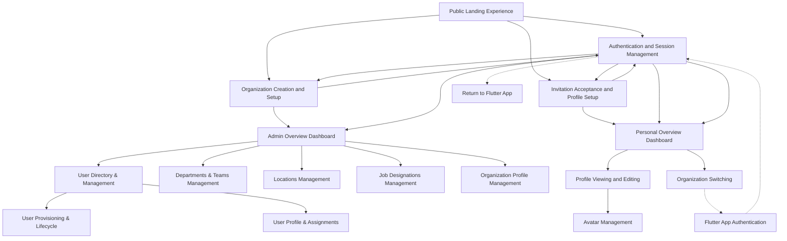

# Circle Foundations App Feature Listing Document

## User Persona Listing

### 1. Guest User
**Description**: Unauthenticated users who are discovering the Circle Ecosystem for the first time or returning users who need to sign in.
**Objectives**: Learn about the platform, create a new organization, or sign in to an existing account.
**Characteristics**: May have varying levels of technical expertise; primarily interested in quick access or understanding the value proposition.

### 2. Organization Administrator (Org Admin)
**Description**: Authenticated users with administrative privileges for managing their organization within the Circle Ecosystem.
**Objectives**: Configure organization settings, manage users, define structure, and ensure proper system setup.
**Characteristics**: Responsible for organizational governance; needs comprehensive controls and visibility across the organization.

### 3. Organization Member (Org Member)
**Description**: Regular authenticated users who are part of an organization within the Circle Ecosystem.
**Objectives**: Participate in organization activities, manage personal profile, and access relevant organizational information.
**Characteristics**: Focused on productivity and collaboration within their specific roles and departments.

## Feature Listing

### Guest User

#### 1. Platform Discovery Module
##### Features
1. **Public Landing Experience**

#### 2. Authentication Module
##### Features
1. **Authentication and Session Management**

#### 3. Organization Creation Module
##### Features
1. **Organization Creation and Setup**

#### 4. Member Onboarding Module
##### Features
1. **Invitation Acceptance and Profile Setup**

### Organization Administrator

#### 1. Admin Dashboard Module
##### Features
1. **Admin Overview Dashboard**

#### 2. People Management Module
##### Features
1. **User Directory & Management**
2. **User Provisioning & Lifecycle**
3. **User Profile & Assignments**

#### 3. Organization Configuration Module
##### Features
1. **Departments & Teams Management**
2. **Locations Management**
3. **Job Designations Management**

#### 4. Organization Settings Module
##### Features
1. **Organization Profile Management**

### Organization Member

#### 1. User Dashboard Module
##### Features
1. **Personal Overview Dashboard**

#### 2. Profile Management Module
##### Features
1. **Profile Viewing and Editing**
2. **Avatar Management**

#### 3. Account Management Module
##### Features
1. **Organization Switching**

## Feature Summary

### Guest User Features

#### 1.1 Public Landing Experience

**Entry Point(s):**
- Direct URL access to platform homepage

**Exit Points:**
- Sign-in flow
- Organization creation flow

**User Stories:**
- As a guest user, I want to understand what the Circle Ecosystem offers so I can decide if it meets my needs
- As a guest user, I want to easily find the sign-in button so I can access my existing account
- As a guest user, I want to see how to create a new organization so I can get started with the platform

**Screen Listing:**
- Homepage with concise value proposition
- Call-to-action areas (Sign In, Create Organization)
- Navigation header

#### 2.1 Authentication and Session Management

**Entry Point(s):**
- Sign-in button on navigation header
- Sign-in CTAs throughout the site
- Session expiration redirects
- Protected page access attempts
- App-to-web handoffs from Flutter applications

**Exit Points:**
- Authenticated user dashboard (Admin or Member)
- Organization selection screen (for users with multiple organizations)
- Onboarding flows for new users
- Return to Flutter app (for mobile/desktop users)

**User Stories:**
- As a returning user, I want to easily sign in to my account so I can access my organization
- As a new or returning user, I want to authenticate via email without passwords so I can securely access my account
- As a user, I want clear instructions on how to complete the authentication process
- As a user, I want clear error messages when authentication fails so I can understand the issue
- As a user, I want guidance on how to resolve authentication problems
- As a user with multiple organizations, I want to select which organization to access
- As a user, I want a seamless transition from authentication to my dashboard
- As a mobile/desktop app user, I want continuity when transitioning between app and web experiences
- As a user, I want my session to be securely established with appropriate permissions

**Screen Listing:**
- Email input screen
- Email link sent confirmation screen
- Authentication processing screen
- Error handling screens (with troubleshooting guidance)
- Support contact options
- Authentication retry options
- Organization selection screen (for users with multiple organizations)
- Authentication processing screen
- Redirect notification for app-to-web transitions
- Session initialization screen

#### 3.1 Organization Creation and Setup

**Entry Point(s):**
- "Create Organization" CTA buttons on public landing page
- Sign-up prompts throughout the platform
- Organization selection screen "Create New" option (for users with existing accounts)

**Exit Points:**
- Admin Dashboard with getting started guide
- Guided tour of admin features

**User Stories:**
- As a new user, I want to verify my email address before creating an organization to ensure security
- As a new user, I want to create a new organization with minimal required information so I can start using the platform immediately
- As a new user, I want a streamlined process that guides me through only essential setup steps
- As a new user, I want to complete my admin profile as part of the organization setup
- As a new user, I want clear progress indicators throughout the setup process

**Screen Listing:**
- Email input screen for passwordless authentication
- Email verification screen (magic link confirmation)
- Organization creation form (name, industry, size)
- Admin profile setup (personal details, role, avatar)
- Essential organization settings (timezone, basic preferences)
- Setup completion confirmation screen
- Getting started guide/walkthrough
- Admin dashboard with prominent next-step suggestions

#### 4.1 Invitation Acceptance and Profile Setup

**Entry Point(s):**
- Invitation email with secure link
- Invitation acceptance landing page
- Public invitation URL

**Exit Points:**
- Personal overview dashboard
- Guided member tour

**User Stories:**
- As an invited user, I want to easily understand and accept my invitation to an organization
- As an invited user, I want to create my account with minimal friction
- As an invited user, I want to set up my profile with relevant professional information
- As an invited user, I want to understand what's expected of me in the organization
- As an invited user, I want to learn about the platform's key features relevant to my role
- As an invited user, I want to be guided through any required onboarding steps

**Screen Listing:**
- Invitation landing page
- Email verification (if not pre-verified)
- Account creation form
- Profile setup (name, job title, contact info)
- Avatar selection/upload
- Department and role confirmation
- Platform introduction and feature highlights
- Onboarding progress indicators
- Member dashboard with getting started guide

### Organization Administrator Features

#### 1.1 Admin Overview Dashboard

**Entry Point(s):**
- Initial sign-in as an admin
- Navigation menu "Dashboard" option

**Exit Points:**
- Any other admin module
- Sign-out
- Organization switching

**User Stories:**
- As an admin, I want a comprehensive overview of my organization's status and activity
- As an admin, I want quick access to all administrative functions from a central location
- As an admin, I want to see important notifications and alerts about my organization

**Screen Listing:**
- Dashboard main view with key metrics
- Organization status summary
- Recent activity feed
- Administrative quicklinks
- Pending tasks/approvals section

#### 2.1 User Directory & Management

**Entry Point(s):**
- Admin dashboard navigation
- Quick access shortcuts
- Organization structure context

**Exit Points:**
- User profile & assignments
- User provisioning flows
- Admin dashboard

**User Stories:**
- As an admin, I want a comprehensive view of all users in my organization
- As an admin, I want to search and filter users based on various criteria
- As an admin, I want to perform batch operations on selected users
- As an admin, I want to change the status of users (active, inactive, suspended)
- As an admin, I want to understand the implications of different user statuses
- As an admin, I want to track status changes and reasons

**Screen Listing:**
- User directory main view
- Advanced search and filter controls
- User listing with key information
- Bulk action interface
- User status controls
- Status change confirmation dialog
- Status reason documentation
- Status history log
- Bulk status update interface
- Export and reporting options

#### 2.2 User Provisioning & Lifecycle

**Entry Point(s):**
- User directory "Invite" action
- Admin dashboard quick action
- Department/team context

**Exit Points:**
- Invitation status tracking
- User directory
- Admin dashboard

**User Stories:**
- As an admin, I want to invite new users to join my organization in the Circle Ecosystem
- As an admin, I want to specify initial details and settings for invited users
- As an admin, I want to track the status of pending invitations
- As an admin, I want to onboard new users with appropriate information and access
- As an admin, I want to manage the full lifecycle of user accounts from creation to retirement

**Screen Listing:**
- User invitation form
- Bulk invitation interface
- Invitation template configuration
- Invitation preview
- Confirmation and status screen
- User onboarding status tracking
- Account lifecycle management interface

#### 2.3 User Profile & Assignments

**Entry Point(s):**
- User directory selection
- User search results
- Administrative actions context

**Exit Points:**
- Return to user directory
- Related user management flows
- Admin dashboard

**User Stories:**
- As an admin, I want to view and edit user profile information
- As an admin, I want to manage user-specific settings and permissions
- As an admin, I want to assign users to departments/teams
- As an admin, I want to assign users to specific locations
- As an admin, I want to assign appropriate job titles to users
- As an admin, I want to establish reporting relationships between users
- As an admin, I want to see a visualization of a user's place in the organization

**Screen Listing:**
- User profile administrative view
- Profile edit interface
- User settings configuration
- Department/team assignment interface
- Location assignment interface
- Job designation assignment interface
- Reporting relationship configuration
- User hierarchy visualization
- Bulk assignment tools for all assignment types
- Assignment history logs

#### 3.1 Departments & Teams Management

**Entry Point(s):**
- Admin dashboard navigation
- Organization configuration section
- Quick action selection

**Exit Points:**
- Return to organization configuration overview
- Admin dashboard

**User Stories:**
- As an admin, I want to create and organize departments and teams that reflect my organization's structure
- As an admin, I want to modify department details as my organization evolves
- As an admin, I want to establish relationships between different organizational units
- As an admin, I want to visualize my entire organizational structure in different formats
- As an admin, I want to navigate through the hierarchy to understand relationships
- As an admin, I want to identify gaps or issues in my organizational structure

**Screen Listing:**
- Department/team listing screen
- Department creation/edit form
- Team creation/edit form
- Department hierarchy viewer
- Batch operations interface
- Hierarchical organization chart
- Department-focused view
- Filter and search controls
- Export and sharing options

#### 3.2 Locations Management

**Entry Point(s):**
- Admin dashboard navigation
- Organization configuration section
- Quick action selection

**Exit Points:**
- Return to organization configuration overview
- Admin dashboard

**User Stories:**
- As an admin, I want to add new office locations to represent my organization's physical presence
- As an admin, I want to categorize locations by type and region
- As an admin, I want to understand what information is required for location setup
- As an admin, I want to maintain comprehensive details about each office location
- As an admin, I want to update location information when changes occur
- As an admin, I want to manage location-specific settings and attributes

**Screen Listing:**
- Location listing screen
- Location creation form
- Location type configuration
- Batch location import interface
- Location creation confirmation
- Location details view
- Location edit form
- Location attributes configuration
- Location status controls
- Location history log

#### 3.3 Job Designations Management

**Entry Point(s):**
- Admin dashboard navigation
- Organization configuration section
- Quick action selection

**Exit Points:**
- Return to organization configuration overview
- Admin dashboard

**User Stories:**
- As an admin, I want to create job titles that reflect the positions in my organization
- As an admin, I want to organize job titles into meaningful categories
- As an admin, I want to establish a consistent naming convention for positions
- As an admin, I want to configure detailed attributes for each job title
- As an admin, I want to establish relationships between different positions
- As an admin, I want to maintain designation-specific settings

**Screen Listing:**
- Designations listing screen
- Job title creation form
- Position category management
- Batch job title import
- Creation confirmation screen
- Designation details view
- Designation edit form
- Designation attributes configuration
- Designation relationships mapping
- Configuration history log

#### 4.1 Organization Profile Management

**Entry Point(s):**
- Admin dashboard navigation
- Organization settings section
- Quick edit actions

**Exit Points:**
- Return to organization settings
- Admin dashboard
- Related configuration flows

**User Stories:**
- As an admin, I want to manage my organization's profile information in the Circle Ecosystem
- As an admin, I want to update organization details as they change
- As an admin, I want to configure organization-wide settings

**Screen Listing:**
- Organization profile overview
- Profile edit form
- Organization logo/branding management
- Contact information configuration
- Organization profile history

### Organization Member Features

#### 1.1 Personal Overview Dashboard

**Entry Point(s):**
- Initial sign-in as a member
- Navigation menu "Dashboard" option

**Exit Points:**
- Any other member module
- Sign-out
- Organization switching

**User Stories:**
- As a member, I want a personalized overview of my workspace and activities
- As a member, I want quick access to frequent actions and information
- As a member, I want to see relevant notifications and updates
- As a member, I want to see a summary of my recent activities in the platform
- As a member, I want to understand pending tasks or actions requiring my attention
- As a member, I want to track my interactions with colleagues and teams

**Screen Listing:**
- Personal dashboard main view
- Activity summary
- Quick access widgets
- Notifications feed
- Personal metrics
- Activity timeline
- Activity categorization and filtering
- Pending actions section
- Interaction history
- Recent items list
- Favorites section
- Contextual shortcuts

#### 2.1 Profile Viewing and Editing

**Entry Point(s):**
- Account menu option
- Dashboard profile widget
- Settings navigation

**Exit Points:**
- Return to dashboard
- Avatar management
- Account settings

**User Stories:**
- As a member, I want to view my complete profile information
- As a member, I want to update my personal and professional details
- As a member, I want to control what information is visible to others

**Screen Listing:**
- Profile overview
- Profile edit interface
- Visibility settings
- Professional information section
- Personal information section

#### 2.2 Avatar Management

**Entry Point(s):**
- Profile editing context
- Avatar-specific actions
- Account settings

**Exit Points:**
- Return to profile view
- Profile editing
- Account settings

**User Stories:**
- As a member, I want to upload and manage my profile picture/avatar
- As a member, I want options for generating or selecting avatars
- As a member, I want to control how my avatar appears across the platform

**Screen Listing:**
- Avatar upload interface
- Image editing tools
- Avatar gallery/selection
- Preview in different contexts
- Avatar history/previous versions

#### 3.2 Organization Switching

**Entry Point(s):**
- Account menu options
- Organization indicator actions
- Sign-in context (for users with multiple organizations)

**Exit Points:**
- Selected organization context
- Account settings
- Sign-out

**User Stories:**
- As a member who belongs to multiple organizations, I want to easily switch between them
- As a member, I want to understand which organization context I'm currently in
- As a member, I want to manage my presence across different organizations

**Screen Listing:**
- Organization selection interface
- Current organization indicator
- Organization-specific status management
- Quick organization switching
- Multi-organization dashboard

## Feature Visualization - Mermaid Diagrams

## Flutter App Handoff Points

### Authentication Flow Handoff
- **Entry Point**: From Flutter app to web authentication
  - Flutter app initiates web authentication via deep link or WebView
  - Web authentication flow preserves origin app context
  - Authentication state and tokens synchronized between platforms

- **Exit Point**: Return to Flutter app after authentication
  - Web authentication completes successfully
  - Authentication tokens securely passed back to Flutter app
  - Session continuity maintained across platform boundaries

### Organization Switching Handoff
- **Entry Point**: From Flutter app to web organization selection
  - Flutter app directs to web organization selection screen
  - Current app state and context preserved in transition

- **Exit Point**: Return to Flutter app with selected organization
  - Organization selection completed in web interface
  - Selected organization context passed back to Flutter app
  - App reconfigures based on selected organization

### Profile Management Handoff
- **Entry Point**: From Flutter app to web profile management
  - Flutter app links to web profile management via deep link
  - Profile context and editing intent preserved in transition

- **Exit Point**: Return to Flutter app after profile updates
  - Profile changes saved in web interface
  - Updated profile data synchronized with Flutter app
  - Flutter app refreshes to reflect profile changes

## Document Validation

This Feature Listing document has been thoroughly reviewed against the provided requirements:

1. **Vertical Slice Architecture Compliance**:
   - Each feature is defined as a self-contained slice with clear entry and exit points
   - Dependencies between features are explicitly defined through exit point linkages
   - Each feature has its own screens that don't overlap with other features

2. **User Flow Completeness**:
   - All required flows are covered: guest landing, org onboarding, org administration, user onboarding, user profile, authentication, and organization switching
   - No loose ends exist - all flows have complete paths from entry to exit
   - Flutter app handoff points are clearly defined

3. **Product Scalability**:
   - Features support both small teams and large corporations
   - Multi-tenancy is built into the architecture
   - Organization structure supports complex hierarchies and reporting relationships

4. **User Experience Optimization**:
   - Onboarding flows are streamlined for minimal friction
   - Administrative features provide necessary depth while maintaining usability
   - Common functions are accessible through quick actions and contextual navigation

5. **Technical Alignment**:
   - Features align with the Next.js web app architecture defined in the tech stack document
   - Authentication flows support both web and future Flutter implementations
   - Multi-tenancy and security requirements are addressed