# Circle Foundations App Feature Listing Document

## User Persona Listing

### 1. Guest User
**Description**: Unauthenticated users who are discovering the Circle Ecosystem for the first time or returning users who need to sign in.
**Objectives**: Learn about the platform, create a new organization, or sign in to an existing account.
**Characteristics**: May have varying levels of technical expertise; primarily interested in quick access or understanding the value proposition.

### 2. Organization Administrator (Org Admin)
**Description**: Authenticated users with administrative privileges for managing their organization within the Circle Ecosystem.
**Objectives**: Configure organization settings, manage users, define structure, and ensure proper system setup.
**Characteristics**: Responsible for organizational governance; needs comprehensive controls and visibility across the organization.

### 3. Organization Member (Org Member)
**Description**: Regular authenticated users who are part of an organization within the Circle Ecosystem.
**Objectives**: Participate in organization activities, manage personal profile, and access relevant organizational information.
**Characteristics**: Focused on productivity and collaboration within their specific roles and departments.

## Feature Listing

### Guest User

#### 1. Platform Discovery Module
##### Features
1. **Public Landing Experience**
2. **Value Proposition Exploration**
3. **Sign-in Access**
4. **Organization Creation**

#### 2. Authentication Module
##### Features
1. **Email Authentication**
2. **Authentication Error Handling**
3. **Session Establishment**

#### 3. Organization Creation Module
##### Features
1. **New Organization Registration**
2. **Initial Admin Setup**
3. **Organization Verification**

### Organization Administrator

#### 1. Admin Dashboard Module
##### Features
1. **Admin Overview Dashboard**
2. **Quick Action Center**
3. **System Status Monitoring**

#### 2. Organization Structure Module
##### Features
1. **Department/Team Management**
2. **Reporting Structure Configuration**
3. **Organizational Hierarchy Visualization**

#### 3. Location Management Module
##### Features
1. **Office/Location Creation**
2. **Location Details Management**
3. **Location Assignment**

#### 4. Designation Management Module
##### Features
1. **Job Title/Position Creation**
2. **Designation Configuration**
3. **Designation Assignment**

#### 5. User Management Module
##### Features
1. **User Directory**
2. **User Invitation**
3. **User Status Management**
4. **User Profile Administration**

#### 6. Organization Settings Module
##### Features
1. **Organization Profile Management**
2. **Multi-Tenancy Configuration**
3. **Organization Preferences**

### Organization Member

#### 1. User Dashboard Module
##### Features
1. **Personal Overview Dashboard**
2. **Quick Access Navigation**
3. **Activity Summary**

#### 2. Profile Management Module
##### Features
1. **Profile Viewing and Editing**
2. **Avatar Management**
3. **Personal Information Configuration**

#### 3. Organization Discovery Module
##### Features
1. **Organization Directory**
2. **Team/Department Exploration**
3. **Colleague Discovery**

#### 4. Account Management Module
##### Features
1. **Account Settings**
2. **Organization Switching**
3. **Session Management**

## Feature Summary

### Guest User Features

#### 1.1 Public Landing Experience

**Entry Point(s):**
- Direct URL access to platform homepage

**Exit Points:**
- Sign-in flow
- Organization creation flow
- Continued exploration of platform information

**User Stories:**
- As a guest user, I want to understand what the Circle Ecosystem offers so I can decide if it meets my needs
- As a guest user, I want to easily find the sign-in button so I can access my existing account
- As a guest user, I want to see how to create a new organization so I can get started with the platform

**Screen Listing:**
- Homepage with value proposition
- Feature showcase sections
- Testimonials/case studies
- Call-to-action areas (Sign In, Create Organization)
- Navigation header

#### 1.2 Value Proposition Exploration

**Entry Point(s):**
- Navigation from homepage
- Direct links to specific value proposition pages

**Exit Points:**
- Organization creation flow
- Sign-in flow
- Return to homepage

**User Stories:**
- As a guest user, I want to explore detailed information about platform features so I can understand the full capabilities
- As a guest user, I want to see how Circle can solve my specific business problems so I can determine its relevance
- As a guest user, I want to understand the pricing and commitment required so I can make an informed decision

**Screen Listing:**
- Feature detail pages
- Use case examples
- Pricing information
- FAQ section
- Contact/support information

#### 1.3 Sign-in Access

**Entry Point(s):**
- Sign-in button on navigation header
- Sign-in CTAs throughout the site

**Exit Points:**
- Authenticated user dashboard (Admin or Member)
- Error handling screens
- Password reset flow
- Organization selection screen (for users with multiple organizations)

**User Stories:**
- As a returning user, I want to easily sign in to my account so I can access my organization
- As a returning user, I want to recover my account if I've forgotten my authentication details
- As a returning user with multiple organizations, I want to select which organization to access

**Screen Listing:**
- Email authentication initiation screen
- Email link sent confirmation
- Error handling screens
- Organization selection screen (if applicable)

#### 1.4 Organization Creation

**Entry Point(s):**
- "Create Organization" CTA buttons
- Sign-up prompts in the platform

**Exit Points:**
- Initial admin setup flow
- Organization verification flow
- Welcome/onboarding tutorials

**User Stories:**
- As a new user, I want to easily create a new organization so I can start using the platform
- As a new user, I want a clear indication of the steps required to complete my organization setup
- As a new user, I want to understand what information is required before I begin the process

**Screen Listing:**
- Organization creation entry screen
- Organization basic information form
- Creation confirmation screen
- Initial steps guidance

#### 2.1 Email Authentication

**Entry Point(s):**
- Sign-in button clicks
- Session expiration redirects
- Protected page access attempts

**Exit Points:**
- Successful authentication to dashboard
- Authentication error handling
- Organization selection (if applicable)

**User Stories:**
- As a user, I want to authenticate via email without passwords so I can securely access my account
- As a user, I want clear instructions on how to complete the authentication process
- As a user, I want to know if my authentication attempt fails so I can try again

**Screen Listing:**
- Email input screen
- Email sent confirmation screen
- Authentication processing screen
- Error handling screens

#### 2.2 Authentication Error Handling

**Entry Point(s):**
- Failed authentication attempts
- Expired authentication links
- Invalid authentication states

**Exit Points:**
- Retry authentication
- Contact support
- Return to homepage

**User Stories:**
- As a user, I want clear error messages when authentication fails so I can understand the issue
- As a user, I want guidance on how to resolve authentication problems
- As a user, I want multiple recovery options if I cannot authenticate normally

**Screen Listing:**
- Authentication error screen
- Troubleshooting guidance screen
- Support contact options
- Authentication retry options

#### 2.3 Session Establishment

**Entry Point(s):**
- Successful email link verification
- App-to-web handoffs from Flutter applications

**Exit Points:**
- Authenticated user dashboard
- Organization selection (if applicable)
- Onboarding flows for new users

**User Stories:**
- As a user, I want a seamless transition from authentication to my dashboard
- As a mobile/desktop app user, I want continuity when transitioning between app and web experiences
- As a user, I want my session to be securely established with appropriate permissions

**Screen Listing:**
- Authentication processing screen
- Redirect notification for app-to-web transitions
- Session initialization screen

#### 3.1 New Organization Registration

**Entry Point(s):**
- "Create Organization" button from homepage or landing pages
- New organization option from organization selection screen

**Exit Points:**
- Initial admin setup flow
- Organization verification process
- Welcome tutorial/guided setup

**User Stories:**
- As a new user, I want to register my organization with minimal required information to get started quickly
- As a new user, I want to understand the organization creation process before I commit
- As a new user, I want confirmation that my organization was created successfully

**Screen Listing:**
- Organization registration form
- Industry/size selection options
- Terms acceptance screen
- Registration confirmation screen

#### 3.2 Initial Admin Setup

**Entry Point(s):**
- Automatic continuation from successful organization registration
- Reminder emails for incomplete setup

**Exit Points:**
- Organization verification flow
- Admin dashboard with getting started guide
- Guided tour of admin features

**User Stories:**
- As a new admin, I want to complete essential organization configuration before inviting others
- As a new admin, I want guidance on the most important setup tasks
- As a new admin, I want to understand how to start building my organization structure

**Screen Listing:**
- Admin profile completion form
- Essential organization settings screens
- Initial structure setup options
- Getting started checklist

#### 3.3 Organization Verification

**Entry Point(s):**
- Automatic continuation from initial admin setup
- Verification reminder emails

**Exit Points:**
- Complete admin dashboard access
- Feature restriction notifications
- Verification support options

**User Stories:**
- As a new admin, I want to verify my organization to access all platform features
- As a new admin, I want to understand the verification requirements and process
- As a new admin, I want clear feedback on verification status and any issues

**Screen Listing:**
- Verification requirements screen
- Document/information submission forms
- Verification status tracker
- Verification success/issues screens

### Organization Administrator Features

#### 1.1 Admin Overview Dashboard

**Entry Point(s):**
- Initial sign-in as an admin
- Navigation menu "Dashboard" option

**Exit Points:**
- Any other admin module
- Sign-out
- Organization switching

**User Stories:**
- As an admin, I want a comprehensive overview of my organization's status and activity
- As an admin, I want quick access to all administrative functions from a central location
- As an admin, I want to see important notifications and alerts about my organization

**Screen Listing:**
- Dashboard main view with key metrics
- Organization status summary
- Recent activity feed
- Administrative quicklinks
- Pending tasks/approvals section

#### 1.2 Quick Action Center

**Entry Point(s):**
- Dashboard widget
- Persistent UI element across admin screens

**Exit Points:**
- Specific action flows (user invite, department creation, etc.)
- Return to previous screen

**User Stories:**
- As an admin, I want to perform common actions quickly without navigating through multiple screens
- As an admin, I want shortcuts to my most-used administrative functions
- As an admin, I want to see recently executed actions for reference

**Screen Listing:**
- Quick action dropdown/panel
- Action confirmation dialogs
- Success/failure notification states
- Recent actions history

#### 1.3 System Status Monitoring

**Entry Point(s):**
- Dashboard status widget
- Admin navigation menu option

**Exit Points:**
- Detailed status investigation screens
- Support contact options
- Return to dashboard

**User Stories:**
- As an admin, I want visibility into the health and status of my Circle implementation
- As an admin, I want notifications of any system issues that might affect my organization
- As an admin, I want to understand the impact of any system status changes

**Screen Listing:**
- System status overview
- Component-specific status details
- Historical status tracker
- Issue resolution information

#### 2.1 Department/Team Management

**Entry Point(s):**
- Admin dashboard navigation
- Quick action selection
- Organization structure section

**Exit Points:**
- Return to organization structure overview
- Proceed to reporting structure configuration
- Return to admin dashboard

**User Stories:**
- As an admin, I want to create and organize departments and teams that reflect my organization's structure
- As an admin, I want to modify department details as my organization evolves
- As an admin, I want to establish relationships between different organizational units

**Screen Listing:**
- Department/team listing screen
- Department creation/edit form
- Team creation/edit form
- Department hierarchy viewer
- Batch operations interface

#### 2.2 Reporting Structure Configuration

**Entry Point(s):**
- Organization structure section
- Admin dashboard navigation
- User profile management context

**Exit Points:**
- Organization structure overview
- User management views
- Admin dashboard

**User Stories:**
- As an admin, I want to establish reporting relationships between users in my organization
- As an admin, I want to visualize and modify the reporting chain for specific individuals
- As an admin, I want to update reporting structures when organizational changes occur

**Screen Listing:**
- Reporting structure overview
- Manager assignment interface
- Direct reports management
- Bulk reporting relationship editor
- Reporting chain visualization

#### 2.3 Organizational Hierarchy Visualization

**Entry Point(s):**
- Organization structure section
- Admin dashboard navigation
- Reports/analytics section

**Exit Points:**
- Organization structure management
- Export/share options
- Admin dashboard

**User Stories:**
- As an admin, I want to visualize my entire organizational structure in different formats
- As an admin, I want to navigate through the hierarchy to understand relationships
- As an admin, I want to identify gaps or issues in my organizational structure

**Screen Listing:**
- Hierarchical organization chart
- Department-focused view
- Reporting chain visualization
- Filter and search controls
- Export and sharing options

#### 3.1 Office/Location Creation

**Entry Point(s):**
- Admin dashboard navigation
- Organization settings section
- Quick action selection

**Exit Points:**
- Location details management
- Return to locations overview
- Admin dashboard

**User Stories:**
- As an admin, I want to add new office locations to represent my organization's physical presence
- As an admin, I want to categorize locations by type and region
- As an admin, I want to understand what information is required for location setup

**Screen Listing:**
- Location listing screen
- Location creation form
- Location type configuration
- Batch location import interface
- Location creation confirmation

#### 3.2 Location Details Management

**Entry Point(s):**
- Location listing screen
- Location search results
- Quick edit actions

**Exit Points:**
- Return to location listing
- Location assignment
- Admin dashboard

**User Stories:**
- As an admin, I want to maintain comprehensive details about each office location
- As an admin, I want to update location information when changes occur
- As an admin, I want to manage location-specific settings and attributes

**Screen Listing:**
- Location details view
- Location edit form
- Location attributes configuration
- Location status controls
- Location history log

#### 3.3 Location Assignment

**Entry Point(s):**
- User management context
- Location details screen
- Bulk operations interface

**Exit Points:**
- User profile view
- Location details
- User directory

**User Stories:**
- As an admin, I want to assign users to their respective office locations
- As an admin, I want to see which users are assigned to specific locations
- As an admin, I want to update location assignments when users move

**Screen Listing:**
- User-to-location assignment interface
- Location occupancy view
- Bulk location assignment tool
- Assignment history log
- Assignment confirmation dialogs

#### 4.1 Job Title/Position Creation

**Entry Point(s):**
- Admin dashboard navigation
- Organization settings section
- Quick action selection

**Exit Points:**
- Designation configuration
- Designations overview
- Admin dashboard

**User Stories:**
- As an admin, I want to create job titles that reflect the positions in my organization
- As an admin, I want to organize job titles into meaningful categories
- As an admin, I want to establish a consistent naming convention for positions

**Screen Listing:**
- Designations listing screen
- Job title creation form
- Position category management
- Batch job title import
- Creation confirmation screen

#### 4.2 Designation Configuration

**Entry Point(s):**
- Job title listing screen
- Position detail view
- Quick edit actions

**Exit Points:**
- Return to designations overview
- Designation assignment
- Admin dashboard

**User Stories:**
- As an admin, I want to configure detailed attributes for each job title
- As an admin, I want to establish relationships between different positions
- As an admin, I want to maintain designation-specific settings

**Screen Listing:**
- Designation details view
- Designation edit form
- Designation attributes configuration
- Designation relationships mapping
- Configuration history log

#### 4.3 Designation Assignment

**Entry Point(s):**
- User management context
- Designation details screen
- Bulk operations interface

**Exit Points:**
- User profile view
- Designation details
- User directory

**User Stories:**
- As an admin, I want to assign appropriate job titles to users in my organization
- As an admin, I want to see which users hold specific designations
- As an admin, I want to update designations when users change roles

**Screen Listing:**
- User-to-designation assignment interface
- Designation distribution view
- Bulk designation assignment tool
- Assignment history log
- Assignment confirmation dialogs

#### 5.1 User Directory

**Entry Point(s):**
- Admin dashboard navigation
- Quick access shortcuts
- Organization structure context

**Exit Points:**
- User profile administration
- User invitation flow
- Admin dashboard

**User Stories:**
- As an admin, I want a comprehensive view of all users in my organization
- As an admin, I want to search and filter users based on various criteria
- As an admin, I want to perform batch operations on selected users

**Screen Listing:**
- User directory main view
- Advanced search and filter controls
- User listing with key information
- Bulk action interface
- Export and reporting options

#### 5.2 User Invitation

**Entry Point(s):**
- User directory "Invite" action
- Admin dashboard quick action
- Department/team context

**Exit Points:**
- Invitation status tracking
- User directory
- Admin dashboard

**User Stories:**
- As an admin, I want to invite new users to join my organization in the Circle Ecosystem
- As an admin, I want to specify initial details and settings for invited users
- As an admin, I want to track the status of pending invitations

**Screen Listing:**
- User invitation form
- Bulk invitation interface
- Invitation template configuration
- Invitation preview
- Confirmation and status screen

#### 5.3 User Status Management

**Entry Point(s):**
- User directory actions
- User profile administration
- Bulk operations interface

**Exit Points:**
- User profile view
- User directory
- Status change confirmation

**User Stories:**
- As an admin, I want to change the status of users (active, inactive, suspended)
- As an admin, I want to understand the implications of different user statuses
- As an admin, I want to track status changes and reasons

**Screen Listing:**
- User status controls
- Status change confirmation dialog
- Status reason documentation
- Status history log
- Bulk status update interface

#### 5.4 User Profile Administration

**Entry Point(s):**
- User directory selection
- User search results
- Administrative actions context

**Exit Points:**
- Return to user directory
- Related user management flows
- Admin dashboard

**User Stories:**
- As an admin, I want to view and edit user profile information
- As an admin, I want to manage user-specific settings and permissions
- As an admin, I want to configure organizational attributes for users

**Screen Listing:**
- User profile administrative view
- Profile edit interface
- User settings configuration
- Organization assignments (department, location, designation)
- Authentication and security settings

#### 6.1 Organization Profile Management

**Entry Point(s):**
- Admin dashboard navigation
- Organization settings section
- Quick edit actions

**Exit Points:**
- Return to organization settings
- Admin dashboard
- Related configuration flows

**User Stories:**
- As an admin, I want to manage my organization's profile information in the Circle Ecosystem
- As an admin, I want to update organization details as they change
- As an admin, I want to configure organization-wide settings

**Screen Listing:**
- Organization profile overview
- Profile edit form
- Organization logo/branding management
- Contact information configuration
- Organization profile history

#### 6.2 Multi-Tenancy Configuration

**Entry Point(s):**
- Organization settings section
- Advanced settings navigation
- Security configuration context

**Exit Points:**
- Organization settings overview
- Security settings
- Admin dashboard

**User Stories:**
- As an admin, I want to configure tenant isolation parameters
- As an admin, I want to understand how multi-tenancy affects my organization
- As an admin, I want to establish secure boundaries for organizational data

**Screen Listing:**
- Tenant configuration overview
- Data isolation settings
- Tenant boundary visualization
- Security policy configuration
- Configuration validation tests

#### 6.3 Organization Preferences

**Entry Point(s):**
- Organization settings section
- Admin dashboard navigation
- System preferences context

**Exit Points:**
- Return to organization settings
- Admin dashboard
- Feature-specific configuration

**User Stories:**
- As an admin, I want to configure organization-wide preferences and defaults
- As an admin, I want to customize the Circle experience for my organization
- As an admin, I want to enable or disable specific platform features

**Screen Listing:**
- Preferences overview
- Feature enablement controls
- Default settings configuration
- User experience customization
- Preference history log

### Organization Member Features

#### 1.1 Personal Overview Dashboard

**Entry Point(s):**
- Initial sign-in as a member
- Navigation menu "Dashboard" option

**Exit Points:**
- Any other member module
- Sign-out
- Organization switching

**User Stories:**
- As a member, I want a personalized overview of my workspace and activities
- As a member, I want quick access to frequent actions and information
- As a member, I want to see relevant notifications and updates

**Screen Listing:**
- Personal dashboard main view
- Activity summary
- Quick access widgets
- Notifications feed
- Personal metrics

#### 1.2 Quick Access Navigation

**Entry Point(s):**
- Dashboard widget
- Persistent UI element across member screens

**Exit Points:**
- Specific feature flows
- Return to previous screen

**User Stories:**
- As a member, I want rapid access to my most frequently used features
- As a member, I want shortcuts to recent items and activities
- As a member, I want a consistent way to navigate regardless of my current context

**Screen Listing:**
- Quick navigation panel/dropdown
- Recent items list
- Favorites section
- Contextual shortcuts

#### 1.3 Activity Summary

**Entry Point(s):**
- Dashboard widget
- Activity-specific navigation
- Notifications context

**Exit Points:**
- Activity detail views
- Related feature screens
- Return to dashboard

**User Stories:**
- As a member, I want to see a summary of my recent activities in the platform
- As a member, I want to understand pending tasks or actions requiring my attention
- As a member, I want to track my interactions with colleagues and teams

**Screen Listing:**
- Activity timeline
- Activity categorization and filtering
- Pending actions section
- Interaction history
- Activity details expansion

#### 2.1 Profile Viewing and Editing

**Entry Point(s):**
- Account menu option
- Dashboard profile widget
- Settings navigation

**Exit Points:**
- Return to dashboard
- Avatar management
- Account settings

**User Stories:**
- As a member, I want to view my complete profile information
- As a member, I want to update my personal and professional details
- As a member, I want to control what information is visible to others

**Screen Listing:**
- Profile overview
- Profile edit interface
- Visibility settings
- Professional information section
- Personal information section

#### 2.2 Avatar Management

**Entry Point(s):**
- Profile editing context
- Avatar-specific actions
- Account settings

**Exit Points:**
- Return to profile view
- Profile editing
- Account settings

**User Stories:**
- As a member, I want to upload and manage my profile picture/avatar
- As a member, I want options for generating or selecting avatars
- As a member, I want to control how my avatar appears across the platform

**Screen Listing:**
- Avatar upload interface
- Image editing tools
- Avatar gallery/selection
- Preview in different contexts
- Avatar history/previous versions

#### 2.3 Personal Information Configuration

**Entry Point(s):**
- Profile editing context
- Account settings
- Onboarding completion flows

**Exit Points:**
- Return to profile view
- Privacy settings
- Dashboard

**User Stories:**
- As a member, I want to configure my detailed personal information
- As a member, I want to manage my contact information and preferences
- As a member, I want to understand which information is required vs. optional

**Screen Listing:**
- Personal details form
- Contact information management
- Communication preferences
- Private information section (visibility restricted)
- Profile completion status

#### 3.1 Organization Directory

**Entry Point(s):**
- Dashboard navigation
- Search results
- Workspace exploration context

**Exit Points:**
- Colleague profiles
- Team/department exploration
- Return to dashboard

**User Stories:**
- As a member, I want to browse through the organization's directory
- As a member, I want to search for colleagues based on various criteria
- As a member, I want to understand the overall organization structure

**Screen Listing:**
- Directory main view
- Search and filter controls
- Directory browsing by category
- Quick contact actions
- Organization statistics

#### 3.2 Team/Department Exploration

**Entry Point(s):**
- Organization directory context
- Dashboard navigation
- Workspace exploration

**Exit Points:**
- Team/department details
- Colleague profiles
- Organization directory

**User Stories:**
- As a member, I want to explore the teams and departments in my organization
- As a member, I want to understand how teams relate to each other
- As a member, I want to discover who works in specific teams/departments

**Screen Listing:**
- Team/department listing
- Department details view
- Team member directory
- Department hierarchy visualization
- Team activity feed

#### 3.3 Colleague Discovery

**Entry Point(s):**
- Organization directory searches
- Team/department context
- Dashboard recommendations

**Exit Points:**
- Colleague profiles
- Communication initiation
- Return to previous context

**User Stories:**
- As a member, I want to find colleagues with specific expertise or roles
- As a member, I want to discover colleagues I might need to work with
- As a member, I want to learn about colleagues' positions and responsibilities

**Screen Listing:**
- Colleague search interface
- Profile discovery recommendations
- Expertise/skill directory
- Role-based colleague finding
- Common connections visualization

#### 4.1 Account Settings

**Entry Point(s):**
- User menu options
- Profile context actions
- Settings navigation

**Exit Points:**
- Return to dashboard
- Profile management
- Sign-out

**User Stories:**
- As a member, I want to manage my account settings and preferences
- As a member, I want to control security and privacy options
- As a member, I want to customize my platform experience

**Screen Listing:**
- Account settings overview
- Security configuration
- Privacy controls
- Notification preferences
- Platform experience customization

#### 4.2 Organization Switching

**Entry Point(s):**
- Account menu options
- Organization indicator actions
- Sign-in context (for users with multiple organizations)

**Exit Points:**
- Selected organization context
- Account settings
- Sign-out

**User Stories:**
- As a member who belongs to multiple organizations, I want to easily switch between them
- As a member, I want to understand which organization context I'm currently in
- As a member, I want to manage my presence across different organizations

**Screen Listing:**
- Organization selection interface
- Current organization indicator
- Organization-specific status management
- Quick organization switching
- Multi-organization dashboard

#### 4.3 Session Management

**Entry Point(s):**
- Account security settings
- Authentication context
- Security notifications

**Exit Points:**
- Account settings
- Sign-out
- Security enhancement flows

**User Stories:**
- As a member, I want to view and manage my active sessions
- As a member, I want to sign out from specific devices or all devices
- As a member, I want to understand my session history for security purposes

**Screen Listing:**
- Active sessions overview
- Session termination controls
- Device history and recognition
- Suspicious activity alerts
- Session preferences configuration

## Feature Visualization - Mermaid Diagrams

```mermaid
graph TD
    %% Guest User Platform Discovery Module
    A1[Public Landing Experience] --> A2[Value Proposition Exploration]
    A1 --> A3[Sign-in Access]
    A1 --> A4[Organization Creation]
    
    %% Guest User Authentication Module
    A3 --> B1[Email Authentication]
    B1 --> B2[Authentication Error Handling]
    B1 --> B3[Session Establishment]
    B2 --> B1
    
    %% Guest User Organization Creation Module
    A4 --> C1[New Organization Registration]
    C1 --> C2[Initial Admin Setup]
    C2 --> C3[Organization Verification]
    
    %% Organization Administrator - Admin Dashboard Module
    B3 --> D1[Admin Overview Dashboard]
    D1 --> D2[Quick Action Center]
    D1 --> D3[System Status Monitoring]
    
    %% Organization Administrator - Organization Structure Module
    D1 --> E1[Department/Team Management]
    E1 --> E2[Reporting Structure Configuration]
    E1 --> E3[Organizational Hierarchy Visualization]
    
    %% Organization Administrator - Location Management Module
    D1 --> F1[Office/Location Creation]
    F1 --> F2[Location Details Management]
    F2 --> F3[Location Assignment]
    
    %% Organization Administrator - Designation Management Module
    D1 --> G1[Job Title/Position Creation]
    G1 --> G2[Designation Configuration]
    G2 --> G3[Designation Assignment]
    
    %% Organization Administrator - User Management Module
    D1 --> H1[User Directory]
    H1 --> H2[User Invitation]
    H1 --> H3[User Status Management]
    H1 --> H4[User Profile Administration]
    
    %% Organization Administrator - Organization Settings Module
    D1 --> I1[Organization Profile Management]
    I1 --> I2[Multi-Tenancy Configuration]
    I1 --> I3[Organization Preferences]
    
    %% Organization Member - User Dashboard Module
    B3 --> J1[Personal Overview Dashboard]
    J1 --> J2[Quick Access Navigation]
    J1 --> J3[Activity Summary]
    
    %% Organization Member - Profile Management Module
    J1 --> K1[Profile Viewing and Editing]
    K1 --> K2[Avatar Management]
    K1 --> K3[Personal Information Configuration]
    
    %% Organization Member - Organization Discovery Module
    J1 --> L1[Organization Directory]
    L1 --> L2[Team/Department Exploration]
    L1 --> L3[Colleague Discovery]
    
    %% Organization Member - Account Management Module
    J1 --> M1[Account Settings]
    M1 --> M2[Organization Switching]
    M1 --> M3[Session Management]
    
    %% Flutter App Handoff Points
    N1[Flutter App Authentication] -.-> B1
    B3 -.-> N2[Return to Flutter App]
    M2 -.-> N1
```

## Flutter App Handoff Points

### Authentication Flow Handoff
- **Entry Point**: From Flutter app to web authentication
  - Flutter app initiates web authentication via deep link or WebView
  - Web authentication flow preserves origin app context
  - Authentication state and tokens synchronized between platforms

- **Exit Point**: Return to Flutter app after authentication
  - Web authentication completes successfully
  - Authentication tokens securely passed back to Flutter app
  - Session continuity maintained across platform boundaries

### Organization Switching Handoff
- **Entry Point**: From Flutter app to web organization selection
  - Flutter app directs to web organization selection screen
  - Current app state and context preserved in transition

- **Exit Point**: Return to Flutter app with selected organization
  - Organization selection completed in web interface
  - Selected organization context passed back to Flutter app
  - App reconfigures based on selected organization

### Profile Management Handoff
- **Entry Point**: From Flutter app to web profile management
  - Flutter app links to web profile management via deep link
  - Profile context and editing intent preserved in transition

- **Exit Point**: Return to Flutter app after profile updates
  - Profile changes saved in web interface
  - Updated profile data synchronized with Flutter app
  - Flutter app refreshes to reflect profile changes

## Document Validation

This Feature Listing document has been thoroughly reviewed against the provided requirements:

1. **Vertical Slice Architecture Compliance**:
   - Each feature is defined as a self-contained slice with clear entry and exit points
   - Dependencies between features are explicitly defined through exit point linkages
   - Each feature has its own screens that don't overlap with other features

2. **User Flow Completeness**:
   - All required flows are covered: guest landing, org onboarding, org administration, user onboarding, user profile, authentication, and organization switching
   - No loose ends exist - all flows have complete paths from entry to exit
   - Flutter app handoff points are clearly defined

3. **Product Scalability**:
   - Features support both small teams and large corporations
   - Multi-tenancy is built into the architecture
   - Organization structure supports complex hierarchies and reporting relationships

4. **User Experience Optimization**:
   - Onboarding flows are streamlined for minimal friction
   - Administrative features provide necessary depth while maintaining usability
   - Common functions are accessible through quick actions and contextual navigation

5. **Technical Alignment**:
   - Features align with the Next.js web app architecture defined in the tech stack document
   - Authentication flows support both web and future Flutter implementations
   - Multi-tenancy and security requirements are addressed
