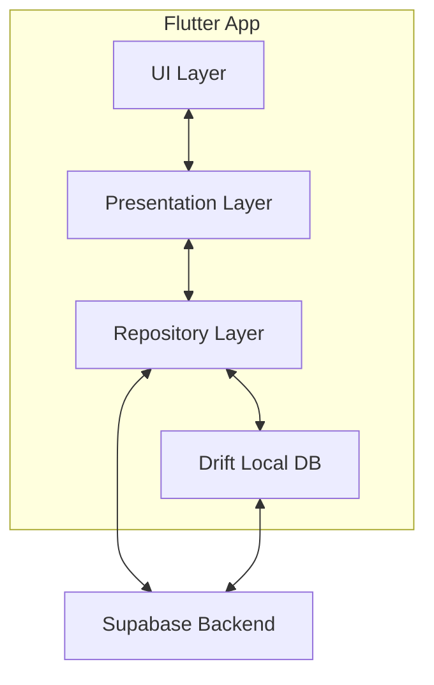
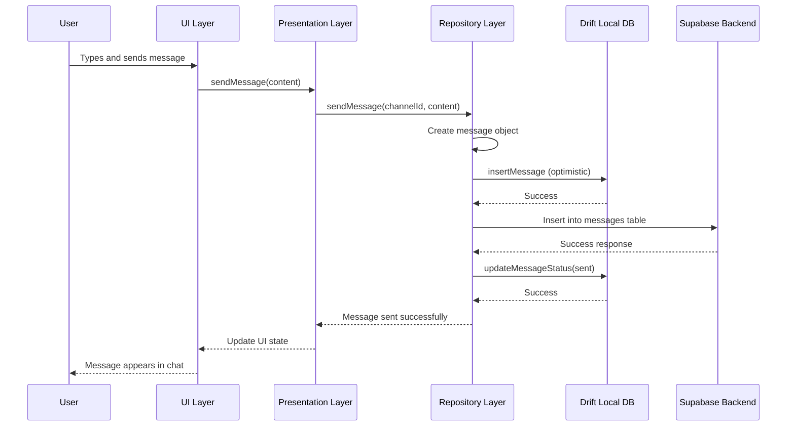
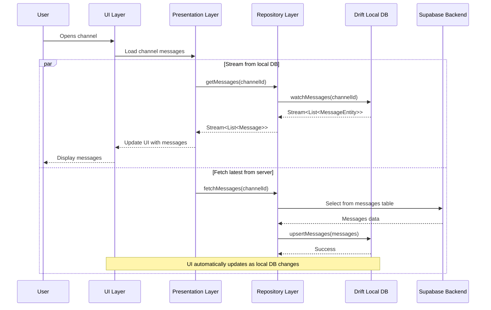
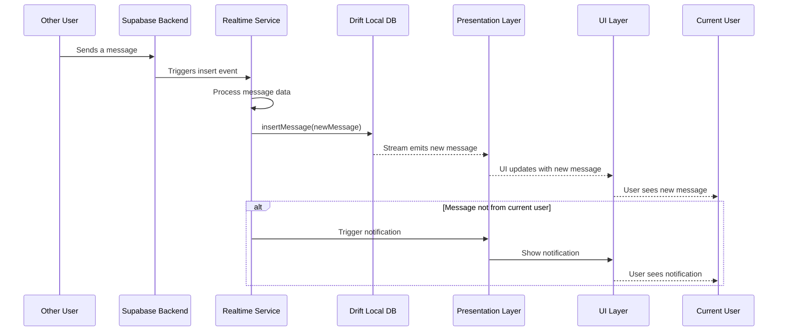
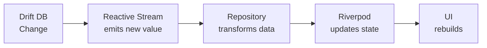

# Anatomy of TeamSync Flutter + Supabase + Drift App

Let me walk you through the architecture and code flow of the TeamSync app, focusing on the interaction between Flutter UI, Supabase backend, and Drift local database.

## 1. Overall Architecture

Let's start with a high-level overview of the TeamSync app architecture:



Based on the tech stack document, TeamSync follows a Vertical Slice Architecture with a feature-first folder structure. Each feature "slice" contains its own repository implementation inspired by PubNub Chat SDK APIs.

## 2. Logical Layers in Detail

### UI Layer
- Handles user interactions and displays data
- Built using Flutter widgets
- Communicates with the Presentation Layer

### Presentation Layer
- Contains UI logic and state management using Riverpod
- Communicates with Repository Layer for data operations
- Handles UI updates and state changes

### Repository Layer
- PubNub-inspired API implementation
- Handles communication with Supabase backend
- Manages business logic for features
- Coordinates Drift local DB operations

### Drift Local Database
- Provides offline data storage
- Type-safe SQLite implementation
- Manages cached data and local state

### Supabase Backend
- Provides PostgreSQL database with Row Level Security (RLS)
- Handles authentication and security
- Manages real-time data synchronization

## 3. Scenario Implementations

Let's explore the three scenarios you requested:

### Scenario 1: Write Operation (Sending a Message)



#### 1. UI Component (message_input.dart)

```dart
// UI Component for message input
class MessageInput extends ConsumerWidget {
  final String channelId;
  
  const MessageInput({required this.channelId, Key? key}) : super(key: key);
  
  @override
  Widget build(BuildContext context, WidgetRef ref) {
    final textController = TextEditingController();
    
    return TextField(
      controller: textController,
      decoration: InputDecoration(
        hintText: 'Type a message',
        suffixIcon: IconButton(
          icon: const Icon(Icons.send),
          onPressed: () {
            if (textController.text.isNotEmpty) {
              // Call the messaging provider to send the message
              ref.read(messagingProvider(channelId)).sendMessage(
                textController.text,
              );
              textController.clear();
            }
          },
        ),
      ),
    );
  }
}
```

#### 2. Presentation Layer (messaging_provider.dart)

```dart
// Using Riverpod for state management
@riverpod
class MessagingNotifier extends _$MessagingNotifier {
  late MessageRepository _repository;
  
  @override
  FutureOr<void> build(String channelId) {
    _repository = ref.read(messageRepositoryProvider);
  }
  
  Future<void> sendMessage(String content) async {
    state = const AsyncLoading();
    
    try {
      // Call repository to send message
      final messageId = await _repository.sendMessage(
        channelId: channelId,
        content: content,
      );
      
      state = AsyncData(null);
    } catch (e, stackTrace) {
      state = AsyncError(e, stackTrace);
    }
  }
}
```

#### 3. Repository Layer (message_repository.dart)

```dart
// PubNub-inspired repository implementation
class MessageRepository {
  final SupabaseClient _supabaseClient;
  final MessageDao _messageDao;
  
  MessageRepository(this._supabaseClient, this._messageDao);
  
  Future<String> sendMessage({
    required String channelId,
    required String content,
  }) async {
    // Generate a UUID for the new message
    final messageId = const Uuid().v4();
    final userId = _supabaseClient.auth.currentUser!.id;
    final timestamp = DateTime.now().toUtc();
    
    // Create message object
    final message = Message(
      id: messageId,
      channelId: channelId,
      senderId: userId,
      content: content,
      timestamp: timestamp,
      status: MessageStatus.sending,
    );
    
    // Save to local DB first (optimistic update)
    await _messageDao.insertMessage(
      MessageEntity(
        id: message.id,
        channelId: message.channelId,
        senderId: message.senderId,
        content: message.content,
        timestamp: message.timestamp,
        status: MessageStatus.sending.index,
      ),
    );
    
    try {
      // Send to Supabase
      await _supabaseClient
          .from('messages')
          .insert({
            'id': message.id,
            'channel_id': message.channelId,
            'sender_id': message.senderId,
            'content': message.content,
            'timestamp': message.timestamp.toIso8601String(),
          });
      
      // Update local status to sent
      await _messageDao.updateMessageStatus(
        message.id, 
        MessageStatus.sent.index,
      );
      
      return messageId;
    } catch (e) {
      // Update local status to failed
      await _messageDao.updateMessageStatus(
        message.id, 
        MessageStatus.failed.index,
      );
      rethrow;
    }
  }
}
```

#### 4. Drift Local DB (message_dao.dart)

```dart
// Drift DAO for message operations
class MessageDao {
  final AppDatabase _db;
  
  MessageDao(this._db);
  
  Future<void> insertMessage(MessageEntity message) {
    return _db.into(_db.messages).insert(message);
  }
  
  Future<void> updateMessageStatus(String messageId, int status) {
    return (_db.update(_db.messages)
      ..where((m) => m.id.equals(messageId)))
      .write(MessagesCompanion(status: Value(status)));
  }
  
  Stream<List<MessageEntity>> watchMessages(String channelId) {
    return (_db.select(_db.messages)
      ..where((m) => m.channelId.equals(channelId))
      ..orderBy([(m) => OrderingTerm.asc(m.timestamp)]))
      .watch();
  }
}
```

### Scenario 2: Read Operation (Loading Channel Messages)



#### 1. UI Component (channel_messages.dart)

```dart
// UI component to display channel messages
class ChannelMessages extends ConsumerWidget {
  final String channelId;
  
  const ChannelMessages({required this.channelId, Key? key}) : super(key: key);
  
  @override
  Widget build(BuildContext context, WidgetRef ref) {
    // Watch messages from provider
    final messagesStream = ref.watch(channelMessagesProvider(channelId));
    
    return messagesStream.when(
      data: (messages) => ListView.builder(
        itemCount: messages.length,
        itemBuilder: (context, index) {
          final message = messages[index];
          return MessageBubble(message: message);
        },
      ),
      loading: () => const Center(child: CircularProgressIndicator()),
      error: (error, stackTrace) => Center(
        child: Text('Error loading messages: $error'),
      ),
    );
  }
}
```

#### 2. Presentation Layer (channel_messages_provider.dart)

```dart
// Riverpod provider for channel messages
@riverpod
Stream<List<Message>> channelMessages(
  ChannelMessagesRef ref,
  String channelId,
) {
  final repository = ref.watch(channelRepositoryProvider);
  return repository.getMessages(channelId: channelId);
}

// Provider for initial load of messages
@riverpod
Future<void> loadInitialMessages(
  LoadInitialMessagesRef ref,
  String channelId,
) async {
  final repository = ref.watch(channelRepositoryProvider);
  await repository.fetchMessages(channelId: channelId);
}
```

#### 3. Repository Layer (channel_repository.dart)

```dart
// PubNub-inspired channel repository
class ChannelRepository {
  final SupabaseClient _supabaseClient;
  final ChannelDao _channelDao;
  final MessageDao _messageDao;
  
  ChannelRepository(
    this._supabaseClient, 
    this._channelDao,
    this._messageDao,
  );
  
  // Stream messages from local DB
  Stream<List<Message>> getMessages({required String channelId}) {
    return _messageDao.watchMessages(channelId).map((entities) {
      return entities.map((entity) => Message(
        id: entity.id,
        channelId: entity.channelId,
        senderId: entity.senderId,
        content: entity.content,
        timestamp: entity.timestamp,
        status: MessageStatus.values[entity.status],
      )).toList();
    });
  }
  
  // Fetch messages from Supabase and update local DB
  Future<void> fetchMessages({required String channelId}) async {
    try {
      final response = await _supabaseClient
          .from('messages')
          .select()
          .eq('channel_id', channelId)
          .order('timestamp');
      
      final messages = (response as List<dynamic>).map((data) {
        return MessageEntity(
          id: data['id'],
          channelId: data['channel_id'],
          senderId: data['sender_id'],
          content: data['content'],
          timestamp: DateTime.parse(data['timestamp']),
          status: MessageStatus.sent.index,
        );
      }).toList();
      
      // Update local database
      await _messageDao.upsertMessages(messages);
    } catch (e) {
      print('Error fetching messages: $e');
      rethrow;
    }
  }
}
```

#### 4. Drift Local DB (message_dao.dart - additional methods)

```dart
// Additional methods for the MessageDao
class MessageDao {
  // ... previous methods
  
  Future<void> upsertMessages(List<MessageEntity> messages) async {
    await _db.batch((batch) {
      for (final message in messages) {
        batch.insert(
          _db.messages,
          message,
          mode: InsertMode.insertOrReplace,
        );
      }
    });
  }
}
```

### Scenario 3: Realtime Signal (New Message Notification)



#### 1. Supabase Realtime Setup (app_initialization.dart)

```dart
// Setup Supabase realtime subscriptions
void setupSupabaseRealtime(SupabaseClient supabaseClient, MessageDao messageDao) {
  // Subscribe to 'messages' table
  supabaseClient
      .from('messages')
      .on(SupabaseEventTypes.insert, (payload) {
        // Handle new message
        final data = payload.newRecord!;
        final message = MessageEntity(
          id: data['id'],
          channelId: data['channel_id'],
          senderId: data['sender_id'],
          content: data['content'],
          timestamp: DateTime.parse(data['timestamp']),
          status: MessageStatus.sent.index,
        );
        
        // Update local DB with new message
        messageDao.insertMessage(message);
      })
      .subscribe();
}
```

#### 2. Realtime Event Handling (realtime_provider.dart)

```dart
// Riverpod provider to handle realtime events
@riverpod
class RealtimeNotifier extends _$RealtimeNotifier {
  late StreamSubscription _subscription;
  
  @override
  void build() {
    final supabase = ref.watch(supabaseClientProvider);
    final messageDao = ref.watch(messageDaoProvider);
    
    // Initialize realtime subscription
    _subscription = supabase
        .from('messages')
        .stream(['id'])
        .listen((List<Map<String, dynamic>> data) {
          for (final message in data) {
            // Process new message
            _handleNewMessage(message, messageDao);
          }
        });
    
    ref.onDispose(() {
      _subscription.cancel();
    });
  }
  
  Future<void> _handleNewMessage(
    Map<String, dynamic> data,
    MessageDao messageDao,
  ) async {
    // Convert to entity and insert to local DB
    final message = MessageEntity(
      id: data['id'],
      channelId: data['channel_id'],
      senderId: data['sender_id'],
      content: data['content'],
      timestamp: DateTime.parse(data['timestamp']),
      status: MessageStatus.sent.index,
    );
    
    await messageDao.insertMessage(message);
    
    // Optionally show notification if message is not from current user
    final currentUserId = ref.read(currentUserIdProvider);
    if (data['sender_id'] != currentUserId) {
      ref.read(notificationServiceProvider).showMessageNotification(
        senderId: data['sender_id'],
        content: data['content'],
      );
    }
  }
}
```

## 4. Key Components Overview

### Drift Database Tables

```dart
// Drift database definition
@DriftDatabase(tables: [Messages, Channels, Users])
class AppDatabase extends _$AppDatabase {
  AppDatabase(QueryExecutor e) : super(e);
  
  @override
  int get schemaVersion => 1;
}

// Messages table definition
class Messages extends Table {
  TextColumn get id => text()();
  TextColumn get channelId => text()();
  TextColumn get senderId => text()();
  TextColumn get content => text()();
  DateTimeColumn get timestamp => dateTime()();
  IntColumn get status => integer()();
  
  @override
  Set<Column> get primaryKey => {id};
}
```

### PubNub-Inspired API Implementation

#### Channel API Implementation

```dart
// PubNub-inspired Channel API
class ChannelRepository {
  final SupabaseClient _supabaseClient;
  final ChannelDao _channelDao;
  
  ChannelRepository(this._supabaseClient, this._channelDao);
  
  // Get channel by ID (PubNub-inspired)
  Future<Channel> getChannel({required String channelId}) async {
    // Try to get from local DB first
    final localChannel = await _channelDao.getChannelById(channelId);
    
    if (localChannel != null) {
      return Channel.fromEntity(localChannel);
    }
    
    // If not in local DB, fetch from Supabase
    final response = await _supabaseClient
        .from('channels')
        .select()
        .eq('id', channelId)
        .single();
    
    final channel = Channel(
      id: response['id'],
      name: response['name'],
      description: response['description'],
      type: ChannelType.values[response['type']],
      createdAt: DateTime.parse(response['created_at']),
    );
    
    // Save to local DB
    await _channelDao.insertChannel(channel.toEntity());
    
    return channel;
  }
  
  // Create channel (PubNub-inspired)
  Future<Channel> createChannel({
    required String name,
    String? description,
    ChannelType type = ChannelType.public,
  }) async {
    final channelId = const Uuid().v4();
    final userId = _supabaseClient.auth.currentUser!.id;
    final timestamp = DateTime.now().toUtc();
    
    // Create channel object
    final channel = Channel(
      id: channelId,
      name: name,
      description: description ?? '',
      type: type,
      createdAt: timestamp,
    );
    
    // Save to Supabase
    await _supabaseClient
        .from('channels')
        .insert({
          'id': channel.id,
          'name': channel.name,
          'description': channel.description,
          'type': channel.type.index,
          'created_at': channel.createdAt.toIso8601String(),
          'created_by': userId,
        });
    
    // Save to local DB
    await _channelDao.insertChannel(channel.toEntity());
    
    return channel;
  }
}
```

#### Message API Implementation

```dart
// PubNub-inspired Message API
class MessageRepository {
  // ... constructor and other methods
  
  // Get message history (PubNub-inspired)
  Future<List<Message>> getMessageHistory({
    required String channelId,
    int limit = 50,
    String? startTimeToken,
    String? endTimeToken,
  }) async {
    final query = _supabaseClient
        .from('messages')
        .select()
        .eq('channel_id', channelId)
        .order('timestamp', ascending: false)
        .limit(limit);
    
    // Add time filters if provided
    if (startTimeToken != null) {
      query.gte('timestamp', DateTime.parse(startTimeToken).toIso8601String());
    }
    
    if (endTimeToken != null) {
      query.lte('timestamp', DateTime.parse(endTimeToken).toIso8601String());
    }
    
    final response = await query;
    
    final messages = (response as List<dynamic>).map((data) {
      return Message(
        id: data['id'],
        channelId: data['channel_id'],
        senderId: data['sender_id'],
        content: data['content'],
        timestamp: DateTime.parse(data['timestamp']),
        status: MessageStatus.sent,
      );
    }).toList();
    
    // Update local DB with fetched messages
    await _messageDao.upsertMessages(
      messages.map((m) => m.toEntity()).toList(),
    );
    
    return messages;
  }
  
  // Add message listener (PubNub-inspired)
  Stream<Message> addMessageListener({
    required String channelId,
  }) {
    // This is handled by Drift watching the messages table
    // and Supabase realtime updating it
    return _messageDao.watchMessagesStream(channelId).map(
      (entity) => Message.fromEntity(entity),
    );
  }
}
```

## 5. Integration Points

### Riverpod for State Management

Riverpod provides the glue between UI and data layers:

1. **Providers**: Define dependencies and state management
2. **Consumers**: React to state changes in the UI
3. **StateNotifiers**: Handle business logic and update state

### Drift + Supabase Integration

The key to making Drift and Supabase work together:

1. **Write Operations**:
   - Write to local DB first (optimistic updates)
   - Then write to Supabase
   - Update local status based on success/failure

2. **Read Operations**:
   - Stream data from local DB for UI
   - Fetch from Supabase to update local cache
   - Use Drift's reactive streams for live UI updates

3. **Realtime Updates**:
   - Subscribe to Supabase realtime channels
   - Update local DB when remote changes occur
   - UI automatically updates via Drift streams

This architecture provides a responsive UI experience with offline capabilities while ensuring data consistency with the backend.

Does this cover what you were looking for? Is there any specific aspect of the TeamSync architecture you'd like me to elaborate on?

